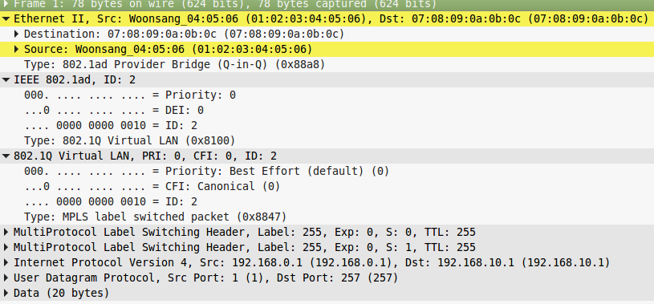

### About
this is a simple pcap generator using scapy. Generator supports the following incapsulatiuon:
* qinq
* vlan
* vntag
* mpls
* pppoe
* ipv4
* udp

### Run
For first time you need to install scapy
```
sudo apt-get install scapy
```
For running generator
```
python scapygenerator.py [list of incapsulatiuon]
```
Output pcap is out.pcap. 

The number of out packet is defined by the constant in scapygenerator.py 
```
count_packets=10
```
The length of data is defined by the constant 
```
len_data_packets=20
```

### Example
```
python scapygenerator.py qinq vlan mpls mpls ipv4 udp
```

